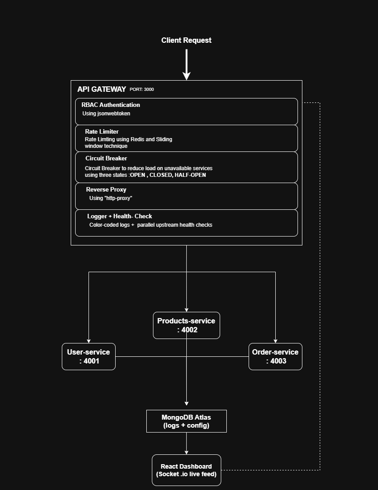
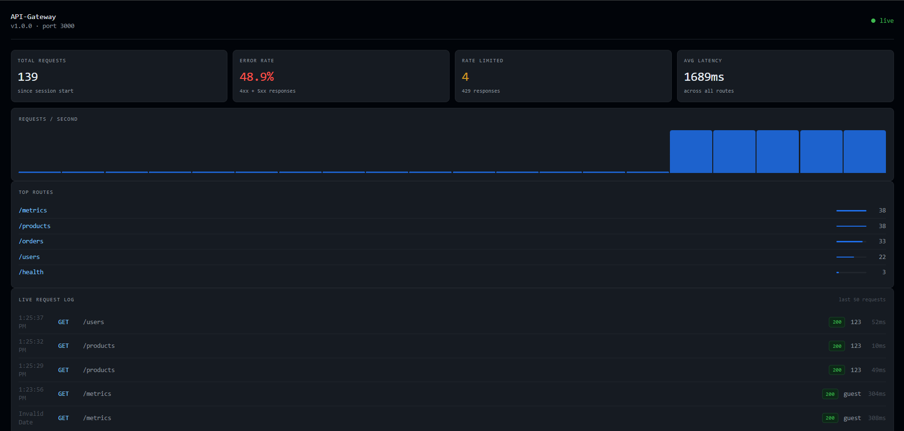
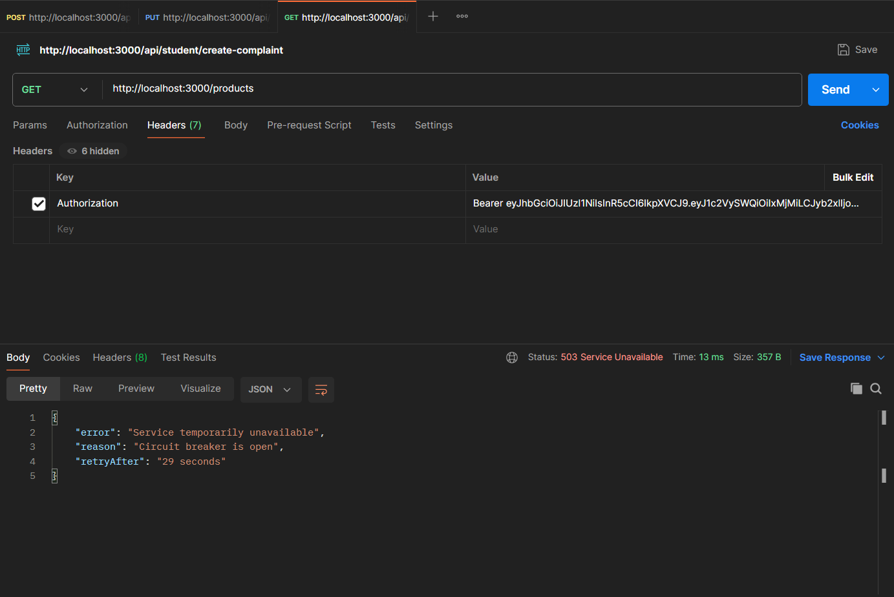

#  API Gateway
 
> A production-grade API Gateway built from scratch in Node.js — no Express — featuring reverse proxying, JWT/RBAC auth, Redis rate limiting, circuit breaking, structured logging, health check metrics, and a real-time monitoring dashboard.
 
---
 
##  Why This Project?
 
An API Gateway is the **single entry point** for all client requests in a microservices architecture. Instead of clients talking to multiple services directly, they talk to one gateway that handles everything: authentication, routing, rate limiting, circuit breaking, and observability — all before a request ever reaches your upstream services.
 
Built this to deeply understand what happens *under the hood* of tools like **Kong**, **AWS API Gateway**, and **NGINX** — and to prove I could build one from scratch.
 
---
 
##  Tech Stack
 
| Layer             | Technology                                          |
|-------------------|-----------------------------------------------------|
| Runtime           | Node.js (native `http` module, no Express)          |
| Auth              | JWT + RBAC middleware                               |
| Rate Limiting     | Redis (INCR/TTL + sliding window)                   |
| Reverse Proxy     | `http-proxy` package                                |
| Circuit Breaker   | Custom 3-state (CLOSED / OPEN / HALF-OPEN)          |
| Logging           | Custom color-coded logger + file persistence        |
| Health Checks     | Parallel checks via `Promise.all`                   |
| Real-time UI      | Socket.io + React + Tailwind CSS                    |
| Persistence       | MongoDB Atlas (TTL-indexed request logs)            |
| Config Reload     | MongoDB Change Streams (hot reload, no restart)     |
| Containerization  | Docker + Docker Compose                             |
 
---

##  System Architecture



---


##  Features
 
- **Reverse Proxy** — Routes incoming requests to the correct downstream microservice using `http-proxy`
- **JWT + RBAC Auth** — Verifies tokens and enforces role-based access control per route before forwarding
- **Redis Rate Limiting** — Per-IP sliding window rate limiting using Redis INCR/TTL; blocks requests that exceed the threshold
- **Circuit Breaker** — Custom 3-state machine (CLOSED → OPEN → HALF-OPEN) that stops forwarding to unhealthy services and auto-recovers
- **Structured Logging** — Color-coded console output with request metadata (method, path, status, latency) + file persistence for every request and error
- **Health Check Metrics** — Periodic parallel health checks via `Promise.all` across all upstream services, exposing per-service latency, status (UP/DOWN), and surfacing results live on the dashboard
- **Custom Header Injection** — Attaches metadata headers (e.g. `X-Request-ID`, `X-Forwarded-For`) before forwarding to upstream services
- **Hot Config Reload** — Live route/config updates via MongoDB Change Streams — no server restart needed
- **Request Log Persistence** — All request logs stored in MongoDB Atlas with TTL indexes for automatic expiry
- **Real-time Dashboard** — Socket.io + React dashboard showing live traffic, latency, error rates, circuit breaker state, and service health
- **Dockerized** — Gateway, microservices, Redis, and dashboard all orchestrated with Docker Compose
---

##  File Structure

```
api-gateway/
├── gateway/
│   ├── index.js                  
│   ├── socket.js 
│   ├── health.js
│   ├── db.js
│   ├── circuitBreaker.js
│   ├── scripts/
│   │   └── seedRoutes.js
│   ├── models/
│   │   └── RequestLogs.js
│   │   └── Route.js
│   ├── config/  
│   │   └── routeManager.js  
│   │     
├── middleware/
│   ├── auth.js                  
│   ├── logger.js 
│   ├── rateLimiter.js
│   |
│
├── services/
│   ├── order/
│   │   └── index.js
│   │   └── Dockerfile              
│   ├── product/
│   │   └── index.js 
│   │   └── Dockerfile             
│   └── user/
│   |    └── index.js
│   │    └── Dockerfile              
│
├── dashboard/                    
│   ├── src/
│   │   ├── App.jsx
│   │   └── components/
│   │       ├── CircuitPanel.jsx
│   │       ├── LiveChart.jsx
│   │       └── RequestLog.jsx
│   │       └── StatGrid.jsx
│   │       └── TopBar.jsx
│   │       └── TopRoutes.jsx
│   └── Dockerfile
│
├── gateway/Dockerfile
├── docker-compose.yml
├── .env.example
└── README.md
```
 
---

##  Screenshots

### Dashboard Overview


### Circuit Breaker Triggered


---


##  How to Run
 
###  With Docker (Recommended)
 
```bash
# 1. Clone the repo
git clone https://github.com/abhinav-101016/API-Gateway.git
cd api-gateway
 
# 2. Set up environment variables
cp .env.example .env
# Fill in MONGO_URI, REDIS_URL, JWT_SECRET
 
# 3. Start everything
docker-compose up --build
```
 
All services (gateway, microservices, Redis, dashboard) will start automatically.
 
---
 
###  Without Docker (Manual Setup)
 
> Prerequisites: Node.js 18+, Redis running locally, MongoDB Atlas URI
 
```bash
# Terminal 1 — Gateway
cd gateway
npm install
node index.js
 
# Terminal 2 — User Service
cd services/user
node index.js
 
# Terminal 3 —  Product Service 
cd services/product
node index.js
 
# Terminal 4 — Order Service 
cd services/order
node index.js
 
# Terminal 5 — Dashboard
cd dashboard
npm install
npm run dev
```
 
---
 
###  Ports
 
| Service           | Port  |
|-------------------|-------|
| API Gateway       | 3000  |
| User Service      | 4001  |
| Product Service   | 4002  |
| Order Service     | 4003  |
| React Dashboard   | 5173  |
 
---

###  Environment Variables (`.env`)
 
```env
MONGO_URI=your_mongodb_atlas_connection_string
JWT_SECRET=your_super_secret_key
```
 
---

##  Testing the Gateway

Once everything is running, open a new terminal and try these:

### 1. Check if the gateway is alive
curl http://localhost:3000/health


### 2. Hit a protected route with a JWT token
curl -H "Authorization: Bearer your_token_here" http://localhost:3000/order

### 3. Trigger rate limiting — run this multiple times quickly
curl http://localhost:3000/user

# After a few hits you'll see:
# { "error": "Too many requests" }

### 4. Test circuit breaker — stop a service, then hit it
curl http://localhost:3000/product

# You'll see:
# { "error": "Service unavailable", "reason": "Circuit breaker is OPEN" }

---

## Deployment

The API Gateway is deployed on **Railway** with Redis and MongoDB Atlas.

- **Gateway (Live)** — https://api-gateway-production-9380.up.railway.app
- **Full Stack** — Run locally via Docker Compose

> The dashboard and microservices run locally via Docker Compose.  
> The gateway is deployed live as proof of cloud deployment capability.

---

##  What I Learned

Before this project, I knew what these concepts were called. After building
this, I actually understand how they work.

Writing an HTTP server without Express forced me to understand what a
framework actually does — parsing headers, routing requests, chaining
middleware — all the stuff Express hides from you.

Implementing JWT auth from scratch made me realize how simple it actually
is under the hood. A token is just a signed JSON object. RBAC on top of it
is just checking a field in that object before letting the request through.

Redis rate limiting taught me the difference between fixed window and sliding
window — and why the sliding window is harder to game even though it uses
more memory.

The circuit breaker was the most interesting part. It's not just "stop
sending requests to a dead service" — it's about having a recovery strategy.
The HALF-OPEN state is what makes it smart instead of just a simple on/off switch.

Socket.io taught me that real-time isn't magic. It's just a persistent
connection that pushes events instead of waiting for the client to ask.

MongoDB Change Streams felt like a superpower once I understood it — your
config updates live without touching the server. That's the kind of thing
you only appreciate after you've restarted a server one too many times.

Docker made me think in terms of isolated environments for the first time.
Once everything was containerized, I stopped saying "it works on my machine."

---

##  Author
 
**Abhinav Singh**
B.Tech CSE  | Backend Developer
[](https://github.com/abhinav-101016)
[](https://www.linkedin.com/in/abhinav-singh-a1a90a214/)
 
---


 
